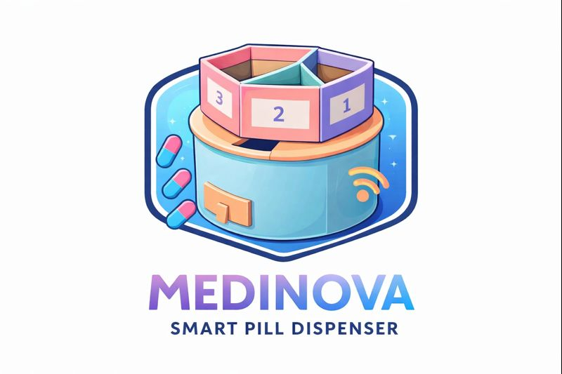
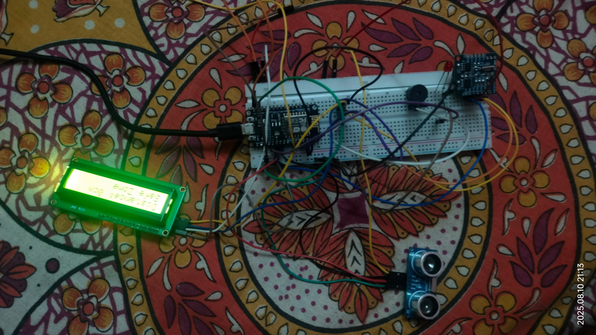
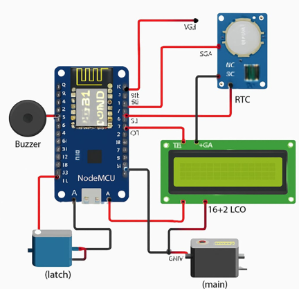
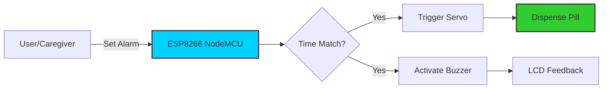
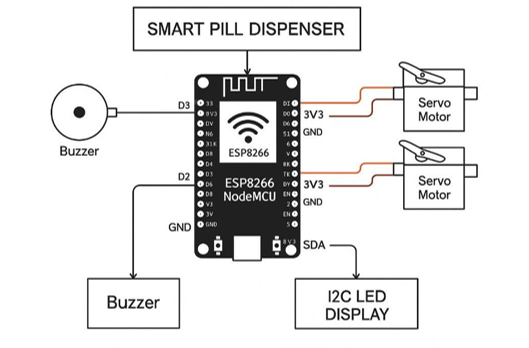

<div align="center">

<!-- LOGO -->


<h1 style="font-size:50px; margin:0;">MEDINOVA</h1>
<p align="center">
  
</p>
<!-- BADGES -->
<p>
 
   
  
  
 
</p>

</div>

---


<table border="0">
  <tr>
    <td align="center">
      
      <br><i><b>"Medinova in motion"</b></i>
    </td>
    <td width="50px"></td>
    <td align="left">
      <h2>📌 Evolution of Care</h2>
      <p><b>MEDINOVA</b> is not just a dispenser; it's a lifeline. Designed for the elderly and chronically ill, it automates the <b>crucial 3:1 ratio</b>—The right pill, at the right time, with the right reminder.</p>
      <ul>
        <li>✅ Reduces Caregiver Fatigue</li>
        <li>✅ Eliminates Human Forgetfulness</li>
        <li>✅ Real-time IoT Monitoring</li>
      </ul>
    </td>
  </tr>
</table>

---

## 📌 What is MEDINOVA?

<p>
<strong>MEDINOVA</strong> is an innovative IoT-based smart medication dispenser designed to automate and improve medication adherence for patients, especially the elderly or chronically ill. It minimizes human error, prevents missed doses, and empowers independent living with smart scheduling and reminders.
</p>
<p><em><strong>Timely doses, healthier lives</strong> — where technology cares.</em></p>

---

## 🧠 Why Medinova Matters

<ul style="line-height:1.7;">
  <li>Patients often miss or forget medication timing.</li>
  <li>Manual reminders and pill boxes are error-prone.</li>
  <li>Caregivers carry heavy responsibility.</li>
  <li>Healthcare calls for smart automation that’s simple and reliable.</li>
</ul>

<strong>Medinova solves these with automation, alerts, and precision.</strong>

---
<h2>🚀 Core Intelligence Features</h2>

<table>
  <tr>
    <td align="center" width="33%">
      <br>
      <b>RTC Precision</b><br>
      DS3231 ensures millisecond-accurate scheduling.
    </td>
    <td align="center" width="33%">
      <br>
      <b>Servo Dispensing</b><br>
      Controlled rotation for jam-free pill delivery.
    </td>
    <td align="center" width="33%">
      <br>
      <b>Multi-Alert</b><br>
      Visual LCD feedback paired with auditory buzzer cues.
    </td>
  </tr>
</table>


## ⚙️ How It Works

<div align="center">
  
</div>
<br></br>
<table width="100%" cellpadding="10">
  <tr>
    <td><strong>⏱️ Time Tracking</strong></td>
    <td><strong>Servo Dispensing</strong></td>
    <td><strong>Display Alerts</strong></td>
  </tr>
  <tr>
    <td>Your schedule is set either manually or via UI.</td>
    <td>Servo rotates to the correct compartment.</td>
    <td>LCD + buzzer notify the user.</td>
  </tr>
</table>

---

<h2>🛠️ Technical Foundation</h2>

<table width="100%">
  <tr>
    <th width="50%">📦 Hardware Component</th>
    <th width="50%">🧠 Software & Tools</th>
  </tr>
  <tr>
    <td>
      • <b>ESP8266 / NodeMCU</b> (The Brain)<br>
      • <b>DS3231 RTC</b> (The Watch)<br>
      • <b>Servo Motor</b> (The Hands)<br>
      • <b>I2C LCD 16x2</b> (The Voice)
    </td>
    <td>
      • <b>Arduino IDE</b> (Development Environment)<br>
      • <b>C++ Firmware</b> (Performance Optimized)<br>
      • <b>JSON Config</b> (Extensible Data Management)
    </td>
  </tr>
</table>

---

## 🧠 Software Stack

- 🔧 **Arduino IDE**
- 💻 **C++ (Firmware)**
- 🌐 **IoT-ready architecture**
- 🔄 Easily extensible for apps

---

## ✨ Key Features

<ul style="line-height:1.7;">
  <li>🗓️ Automated pill scheduling</li>
  <li>📤 IoT-connected for future remote insights</li>
  <li>🔊 Alert system with buzzer + LCD</li>
  <li>✔️ Prevents missed doses & overdosing</li>
  <li>🤝 Caregiver reduction, patient autonomy</li>
</ul>

---

<h2>⚙️ System Architecture</h2>


<h2>📈 Advantages</h2>

<table>
  <tr>
    <!-- LEFT SIDE: TEXT -->
    <td width="55%" valign="top">

<ul>
  <li>✅ Smart and reliable medication dispensing</li>
  <li>✅ Reduces human dependency and errors</li>
  <li>✅ Prevents missed doses & overdosing</li>
  <li>✅ Encourages patient independence</li>
  <li>✅ Minimizes caregiver workload, allowing remote supervision instead of constant reminders</li>
  <li>✅ Reduces medication errors caused by forgetfulness or confusion</li>
  <li>✅ Cost-effective solution compared to long-term hospitalization or full-time care</li>
  <li>✅ User-friendly design suitable for elderly users with minimal technical knowledge</li>
</ul>
  </td>
  <td width="45%" align="center">
      
    </td>
  </tr>
</table>

## ⚠️ Current Limitations

<ul style="line-height:1.7;">
  <li>Requires manual refill of pills</li>
  <li>Packaging and hygiene need careful management</li>
  <li>Firmware currently prototype-level</li>
</ul>

---

## 🎯 Use Cases

<ul style="line-height:1.7;">
  <li>🏥 Hospital medication management</li>
  <li>🏡 At-home medication automation</li>
  <li>👵 Senior care homes</li>
  <li>🩺 Chronic disease therapy adherence</li>
</ul>

---

## 🔮 Future Enhancements

<ul style="line-height:1.7;">
  <li>📱 Full mobile app integration</li>
  <li>🔔 Remote notifications for caregivers</li>
  <li>🎙️ Voice assistant + emergency alerts</li>
  <li>🆔 Biometric authentication</li>
  <li>🚨 AI prediction & reminders</li>
</ul>

---

<h2>👥 The Engineering Team</h2> <p><i>Dept of CSE | Mentally Dept of IOT</i></p>

<table> <tr align="center"> <td>


<b>Sankalan Pal</b>


<small>Lead</small></td> <td>


<b>Puskar Nath</b>


<small>Researcher</small></td> <td>


<b>Shayak Sarkar</b>


<small>Researcher</small></td> <td>


<b>Aniraj Saha</b>


<small>Visuals</small></td> <td>


<b>Samadrita</b>


<small>Design</small></td> <td>


<b>Pameli Saha</b>


<small>Design</small></td> </tr> </table>

---

## 📂 Repo Structure

```text
MEDINOVA/
├── firmware/
├── hardware/
├── docs/
├── demo/
├── images/
└── README.md
```
## 📄 License
<p>This project is licensed under the <strong>MIT License</strong>. See <code>LICENSE</code> for details.</p>
⭐ Support the Project
<p> If you find Medinova useful, show some love: </p> <ul> <li>⭐ Star this repository</li> <li>🍴 Fork it</li> <li>💬 Suggest features or improvements</li> </ul> <div align="center"> <h2>MEDINOVA — Engineering care, one dose at a time 💙</h2> </div>
